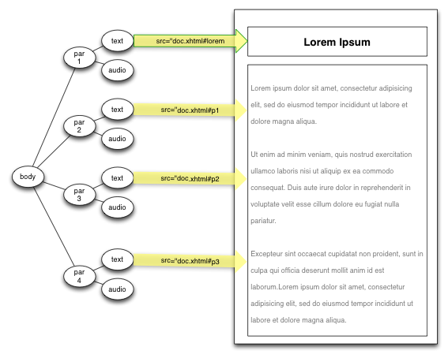

# EPUB3 Media Overlays in Readium

This document describes the implementation of EPUB3 Media Overlays in Readium. A quick recap of this feature, from the [specification](http://idpf.org/epub/30/spec/epub30-mediaoverlays.html):

>Books featuring synchronized audio narration are found in mainstream e-books, educational tools and e-books formatted for persons with print disabilities. In EPUB 3, these types of books are created by using Media Overlay Documents to describe the timing for the pre-recorded audio narration and how it relates to the EPUB Content Document markup. The file format for Media Overlays is defined as a subset of SMIL, a W3C recommendation for representing synchronized multimedia information in XML.

## Goals

The following are the goals of the media overlays implementation:

 * Serve as an example implementation of the [EPUB 3 Media Overlays specification](http://idpf.org/epub/30/spec/epub30-mediaoverlays.html).
 * Allow the user to control the playback via a single play/pause control.
 * Highlight the text as it is played by using either the [author-defined highlight style](http://idpf.org/epub/30/spec/epub30-mediaoverlays.html#sec-docs-assoc-style), or Readium's default highlight style.
 * Follow user navigation actions: when a user turns the page or otherwise navigates to a new part of the book, the media overlay must reposition itself at their new location.
 * Integrate well with existing Readium code, which will continue to be developed independently of media overlays support.
 

## Implementation

This section describes relevant parts of the EPUB3 Media Overlays specification from a reading system implementor's perspective.

### The Media Overlay Object
A media overlay document is essentially a tree structure:

    <smil>
        <body epub:textref="doc.xhtml">
            <par>
                <text src="doc.xhtml#lorem"/>
                <audio src="lorem.mp3" clipBegin="0.0s" clipEnd="1.2s"/>
            </par>
            <par>
                <text src="doc.xhtml#p1"/>
                <audio src="lorem.mp3" clipBegin="1.2s" clipEnd="3.4s"/>
            </par>
            <par>
                <text src="doc.xhtml#p2"/>
                <audio src="lorem.mp3" clipBegin="3.4s" clipEnd="6.2s"/>
            </par>
            <par>
                <text src="doc.xhtml#p3"/>
                <audio src="lorem.mp3" clipBegin="6.2s" clipEnd="8.0s"/>
            </par>
        </body>
    </smil>

The `<par>` elements are the synchronization points. Each `<par>` contains a text reference and an audio clip reference. Each `text @src` refers to an element in a text content document: 

A depth-first traversal renders the tree as a playlist of audio and text synchronization points, in the proper order.
     
Each media overlay document is represented by an object. From a high-level perspective, this object contains a tree of all the synchronization points and also provides playback capabilities. This [API](media_overlays_api.html) is defined in `mediaOverlay.js`. 

The tree is rendered as described in [Basic Playback](http://idpf.org/epub/30/spec/epub30-mediaoverlays.html#sec-behaviors-playback). Basically, the playback order is defined by the tree and its time containers (`<par>`: in parallel, `<seq>` or `<body>`: sequentially). Audio nodes are rendered using the the audio clip player (`audioClipPlayer.js`). Text nodes are rendered by by setting the observable property `current_text_src`. While the media overlays object does not display text by itself, it communicates its current text position to its observers, which then take care of going to the right page and highlighting the proper element.

Worth noting: each `<par>` element is guaranteed to have one text and one audio child element, except for special cases where the the `text @src` refers to embedded media or the text fragment is intended to be rendered by text-to-speech (TTS). These special cases are to be addressed in future revisions.

When [skippability and escapability](http://idpf.org/epub/30/spec/epub30-mediaoverlays.html#sec-behaviors-skip-escape) are added to the media overlays featureset, the underlying tree structure will make it easy to skip or escape branches based on semantic inflection (`@epub:type`).

### Notes About Audio Playback

The audio clip player in `audioClipPlayer.js` wraps the HTML5 audio API. Audio playback had to build on the basic API in order to take into consideration the following:

When one audio clip ends and another begins, if you call `pause()` and then `play()` in the HTML5 audio api, there can be a small glitching sound, or stuttering effect. To avoid this, the audio clip player does not pause the HTML5 audio in between clips. It lets the audio continue, as the subsequent clip is likely to be nearly continguous with the current one. So if the current playback position is between `@clipBegin` and `@clipEnd` of the subsequent clip, then no adjustment is necessary. However, if upon starting the subsequent clip, the current playback position is out of range, then it gets reset to the right value. This might cause a bit of glitching/stuttering, but it happens rarely, because in narrated books, the audio clip timestamps are often contiguous or at least very close.

Another issue is that audio synchronization had to work with Chrome's interval timer granularity. When the window is in focus, this granularty is quite fine: 11ms. However, when the window loses focus, it degrades to as much as 1 second. This means that the player could potentially overplay a clip by an entire second before noticing. Luckily, using the above approach to reduce stutter also gives a lot of leeway regarding what an acceptable current playback position is when starting a clip. Even if the position is getting polled only every second, for most practical use cases, this is sufficient to keep playback smoothly in sync. Even the most challenging type of content, a series of short audio cips, has been tested with this approach and did not have issues.

### Integration into Readium

Starting from the point where media overlays integrate into the publication (see [Packaging](http://idpf.org/epub/30/spec/epub30-mediaoverlays.html#sec-docs-package)), the first step is to create a collection of media overlay objects. The spine contains references to media overlay documents, so, in `package_document_parser.js`, there gets created a map of all media overlay objects, each referred to by its ID.

Note: Each content document is referenced by no more than one media overlay file. This means that given a point in a content document, there is only one possible media overlay document that could contain its corresponding synchronization point. This is a lot easier than, say, searching all the media overlay files to find a content document reference. 
 
 
#### Page synchronization

The primary area of consideration when integrating media overlays with Readium was to ensure that audio playback matched the page display. This involved two things:

 1. During continuous playback, Readium must turn its own pages to match whatever audio is playing. To do this, Readium observes change events on the media overlay object's `current_text_src` and ensures that the correct page is being shown.
 2. When the user turns a page or goes to a new section, media overlay playback needs to be updated so that it resets playback at the correct location. The easiest way to do this is whenever the page changes, it updates the media overlay object.
 
 
The code in `media_overlay_controller.js` acts as a bridge between the media overlay object and the rest of Readium.

#### Highlighting

The other area of consideration was highlighting. According to [Associating Style Information](http://idpf.org/epub/30/spec/epub30-mediaoverlays.html#sec-docs-assoc-style):
>The Reading System would apply the author-defined -epub-media-overlay-active class to each text element in the EPUB Content Document as it became active during playback. Conversely, the class name is removed when the element is no longer active. 
 
Readium also has its own default highlight styles, based on its themes. At the moment, the following rules determine which type of highlight style to use:

For fixed layout books: if exists, apply the author-supplied active-class value. If the author did not include an active-class value, do not highlight anything. In the future, perhaps Readium will have a default highlight for fixed layout books.

For reflowable books: use the author-supplied active-class value. If this is not present, use a highlighting style based on Readium's theme.

Note that Readium does two things for its highlight style: all inactive text fades out and only the active text is rendered in black (or whatever the theme's text color is). In EPUB3, there is no way for authors to specify the color of inactive text, so when using the authored highlight style, there is no fadeout effect applied.

Highlighting code is found in `media_overlay_view_helper.js`.

 
### Issues

 * Proper namespace support: the media overlay object uses jQuery to search its own tree, which does not have good XML namespace support. Therefore, attributes like `epub:type` and `epub:textref` must be named as such. The right thing to do here would be to incorporate a jQuery extension that better supports this.
 * Highlighting: should there be a default highlighting style for fixed layout books? Perhaps this would come along with a user preference for highlighting being on or off.
 * URL matching: Right now, to compare two content document addresses, just the last part of the URL is analyzed (the file name). Practically, this works, but would fail if two identically-named files were placed in different folders. The solution is to use a good URL-comparison utility library, such as [medialize URL.js](http://medialize.github.com/URI.js/). At the moment, Readium uses a different library named URL.js, which does not have the URL comparison features required here, and for which medialize URL.js is not a drop in replacement.
 * DOM vs custom tree structure: right now, the SMIL model inside the media overlay object is built by annotating an XML DOM with playback functions. The benefits to this are that it reduces the overhead not only by simplifying the amount of tree-related code that needs to be written, but also by opening up the SMIL model to existing XML DOM-compatible tools like jQuery. The one downside to this is memory consumption. Keeping a DOM in memory is not cheap. Theoretically, creating a DOM and using it to build a lighter-weight custom tree structure would be the most memory-efficient, because the garbage collector should clean up the DOM once it isn't being used anymore. However, in [experiments](https://github.com/marisademeglio/media-overlays-js/tree/master/experiments/2-smil-models), it appeared that the DOM was not garbage collected by Chrome, thus resulting in the worst case scenario where both the DOM and a custom tree structure are hanging around in memory. Therefore, Readium's media overlays implementation continues to use the DOM. Practically-speaking, the media overlay documents would have to get very large to cause concern regarding memory consumption. Still, this is a point to keep in mind for future developments.

## Future 
 
 These features are on the horizon:
 
 * Option to start MO playback upon opening a book
 * Add keyboard shortcuts (this falls under general accessibility)
 * Add commands to set audio volume and rate
 * Add skippability and escapability 
 * Add fast-forward and rewind, and perhaps a variant of these features that would operate more like DAISY's phrase-level navigation
 * Refine reading experience regarding [embedded media](http://idpf.org/epub/30/spec/epub30-mediaoverlays.html#sec-embedded-media)
 * Let users click a paragraph to start playback
 * Resume the last audio position upon reopening a book
 * Have the library view shows whether a book has MO or not
 
